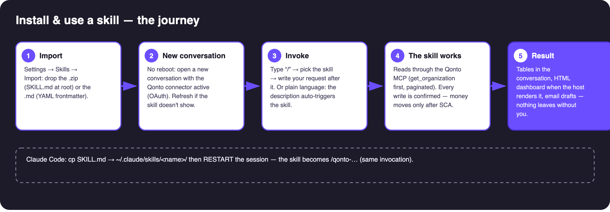
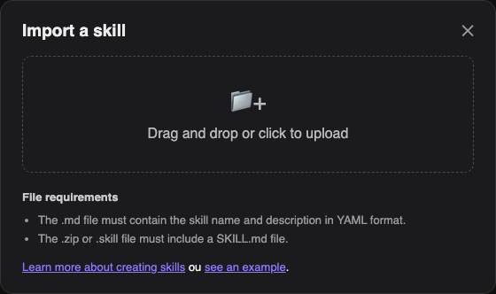
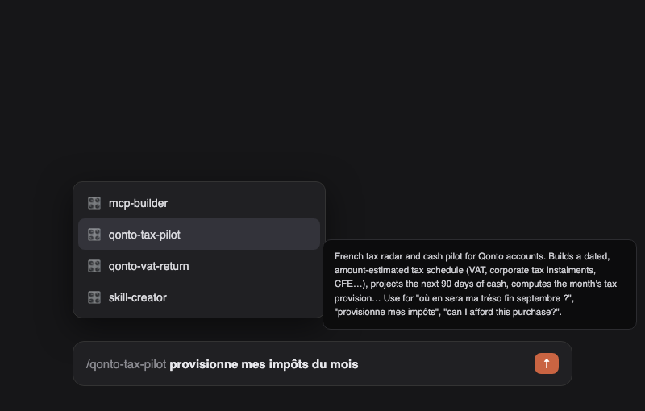

# 📥 Installing a Qonto skill — setup guide (EN)


> 🎬 **Video: the import in 22 seconds** — [`video/qonto-skill-import.mp4`](video/qonto-skill-import.mp4)

> French version: `INSTALLATION.fr.md`. Applies to all 20 skills in this folder.



## ✅ Prerequisites

| Prerequisite | Detail |
|---|---|
| **The skill file: `.md` OR `.zip`** | The **`.md` alone is enough** as long as it carries the `name` and `description` in YAML frontmatter — all 20 `SKILL.md` files do (verified). A **`.zip`** must contain a `SKILL.md` at its root — 20 ready-made zips live in **`_zips/`** (`qonto-tax-pilot.zip`, …), recommended because they are clearly named. |
| **SKILL.md language** | **English** — the PR deliverable convention (international jury), and how all 20 files are written. The French docs (`README.fr.md`, `docs/PROCEDURE.fr.md`) are companion material, not what you import. |
| **Qonto connector connected** | claude.ai / Claude Desktop: Settings → Connectors → Qonto → OAuth sign-in (your password is never shared). Without it the skill installs fine but has nothing to read. |
| **Optional MCPs per skill** | Gmail, Drive, Datagouv, Shopify, Short.io… — each skill detects them and degrades gracefully when absent. |

## 1️⃣ claude.ai (and Claude Desktop)

1. **Settings → Skills** → **Import a skill**
2. The dialog below opens: **drop the skill's `.zip`** (or its `SKILL.md`)



3. Claude reads the YAML frontmatter (`name` + `description`) and registers the skill
4. Open a conversation (with the Qonto connector active) → the skill is available; some interfaces require **enabling** it in the conversation or project options

## 2️⃣ Claude Code (CLI / VS Code)

1. **Copy** the SKILL.md into the skills folder (one subfolder per skill, named after it):
```bash
mkdir -p ~/.claude/skills/qonto-tax-pilot
cp 01-qonto-tax-pilot/SKILL.md ~/.claude/skills/qonto-tax-pilot/
```
2. **Restart the session** (`exit` then `claude`, or a new session) — skills load at startup
3. **Check**: type `/qonto` → the skill shows in the autocomplete
4. **Use**: `/qonto-tax-pilot set aside this month's taxes` — or just the plain-language sentence

> Same prerequisite: the Qonto connector/MCP must be reachable from Claude Code (shared claude.ai connectors or `claude mcp`).

## 3️⃣ Using the skill: the "/" key

In the input box, type **`/`**: the skill picker opens. Pick the skill (its description shows on hover), then **write your request after it**:



```
/qonto-tax-pilot set aside this month's taxes
/qonto-vat-return prepare my June VAT return
/qonto-subscription-audit what got more expensive quietly?
```

You can also **write the sentence without the "/"** — the skill's description carries the trigger phrases, Claude activates it on its own.

➡️ **Example prompts for all 20 skills: [PROMPTS.en.md](../PROMPTS.en.md)**

## ♻️ Do I need to restart Claude?

**No.** On claude.ai / Desktop the skill is available in **new conversations** (an already-open chat won't pick it up — refresh + new chat if it doesn't show). The only exception is **Claude Code**, which loads skills at session start → relaunch `claude` after adding one. Rule of thumb: **import → new conversation → test**.

## 4️⃣ Check that it works (2 min)

1. "**List my Qonto accounts**" → the connector answers (if not: reconnect the connector, not the skill)
2. Run the skill's test prompt (see each `docs/PROCEDURE.en.md` — e.g. vat-return: "Prepare my June VAT return")
3. The skill should announce what it does, paginate properly, and say plainly what it cannot do

## 🔄 Update / remove

- **Update**: re-import the same file (the frontmatter `name` identifies the skill); on Claude Code, replace the file
- **Remove**: Settings → Skills → delete; on Claude Code, delete the folder

## ⚠️ The 3 classic pitfalls

1. Importing a `SKILL.md` **without** YAML frontmatter → rejected by the dialog (all of ours have it)
2. A zip with `SKILL.md` **inside a subfolder** → rejected: it must sit at the root (the `_zips/` archives are compliant)
3. Skill installed but **Qonto connector missing** from the conversation → the skill runs on empty; connect the connector first
