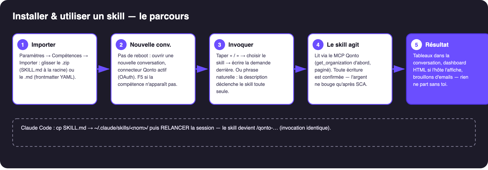
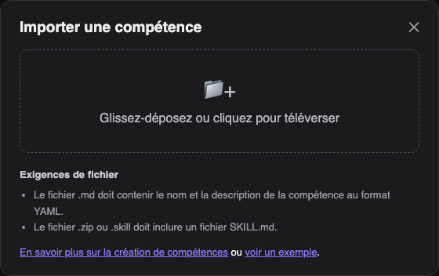

# 📥 Installer un skill Qonto — procédure (FR)


> 🎬 **Vidéo : l'import en 22 secondes** — [`video/qonto-skill-import.mp4`](video/qonto-skill-import.mp4)

> Version anglaise : `INSTALLATION.en.md`. Vaut pour les 20 skills du dossier.



## ✅ Prérequis

| Prérequis | Détail |
|---|---|
| **Le fichier du skill : `.md` OU `.zip`** | Le **`.md` seul suffit** s'il contient le `name` et la `description` en frontmatter YAML — c'est le cas des 20 `SKILL.md` (vérifié). Le **`.zip`** doit contenir un `SKILL.md` à la racine — les 20 zips prêts à l'emploi sont dans **`_zips/`** (`qonto-tax-pilot.zip`, …), recommandés car nommés clairement. |
| **Langue du SKILL.md** | **Anglais** — c'est la convention du livrable PR (jury international) et celle de nos 20 fichiers. Les docs FR (`README.fr.md`, `docs/PROCEDURE.fr.md`) sont là pour toi, pas pour l'import. |
| **Connecteur Qonto branché** | claude.ai / Claude Desktop : Paramètres → Connecteurs → Qonto → connexion OAuth (le mot de passe n'est jamais partagé). Sans lui, le skill s'installe mais ne peut rien lire. |
| **MCP optionnels selon le skill** | Gmail, Drive, Datagouv, Shopify, Short.io… — le skill les détecte et dégrade proprement s'ils manquent. |

## 1️⃣ claude.ai (et Claude Desktop)

1. **Paramètres → Compétences** (Skills) → **Importer une compétence**
2. La fenêtre ci-dessous s'ouvre : **glisse le `.zip`** du skill (ou son `SKILL.md`)



3. Claude lit le frontmatter YAML (`name` + `description`) et enregistre la compétence
4. Ouvre une conversation (avec le connecteur Qonto actif) → la compétence est disponible ; certaines interfaces demandent de l'**activer** dans les options de la conversation ou du projet

## 2️⃣ Claude Code (CLI / VS Code)

1. **Copier** le SKILL.md dans le dossier des skills (un sous-dossier par skill, au nom du skill) :
```bash
mkdir -p ~/.claude/skills/qonto-tax-pilot
cp 01-qonto-tax-pilot/SKILL.md ~/.claude/skills/qonto-tax-pilot/
```
2. **Relancer la session** (`exit` puis `claude`, ou nouvelle session) — les skills sont chargés au démarrage
3. **Vérifier** : taper `/qonto` → le skill apparaît dans l'autocomplétion
4. **Utiliser** : `/qonto-tax-pilot provisionne mes impôts du mois` — ou simplement la phrase en langage naturel

> Prérequis identique : le connecteur/MCP Qonto doit être accessible dans Claude Code (connecteurs claude.ai partagés ou `claude mcp`).

## 3️⃣ Utiliser le skill : la touche « / »

Dans la zone de saisie, tape **`/`** : le sélecteur de compétences s'ouvre. Choisis le skill (sa description s'affiche en survol), puis **écris ta demande derrière** :


```
/qonto-tax-pilot provisionne mes impôts du mois
/qonto-vat-return prépare ma CA3 de juin
/qonto-subscription-audit qu'est-ce qui a augmenté en douce ?
```

Tu peux aussi **écrire la phrase sans le “/”** — la description du skill contient les phrases déclencheuses, Claude l'active tout seul.

➡️ **Les prompts d'exemple des 20 skills : [PROMPTS.fr.md](../PROMPTS.fr.md)**

## ♻️ Faut-il redémarrer Claude ?

**Non.** Sur claude.ai / Desktop, la compétence est disponible pour les **nouvelles conversations** (une conversation déjà ouverte ne la charge pas — F5 + nouveau chat si elle n'apparaît pas). Seule exception : **Claude Code**, qui charge les skills au démarrage de la session → relancer `claude` après l'ajout. Réflexe : **importer → nouvelle conversation → tester**.

## 4️⃣ Vérifier que ça marche (2 min)

1. « **Liste mes comptes Qonto** » → le connecteur répond (sinon : reconnecter le connecteur, pas le skill)
2. Lance le prompt de test du skill (voir la PROCEDURE de chaque skill — ex. vat-return : « Prépare ma CA3 de juin »)
3. Le skill doit annoncer ce qu'il fait, paginer proprement, et dire honnêtement ce qu'il ne peut pas faire

## 🔄 Mettre à jour / retirer

- **Mise à jour** : réimporter le même fichier (le `name` du frontmatter identifie la compétence) ; sur Claude Code, remplacer le fichier
- **Retrait** : Paramètres → Compétences → supprimer ; sur Claude Code, supprimer le dossier

## ⚠️ Les 3 pièges classiques

1. Importer un `SKILL.md` **sans** frontmatter YAML → refusé par la fenêtre (les nôtres l'ont tous)
2. Zip avec le `SKILL.md` **dans un sous-dossier** → refusé : il doit être à la racine (les zips de `_zips/` sont conformes)
3. Skill installé mais **connecteur Qonto absent** de la conversation → le skill tourne à vide ; brancher le connecteur d'abord
